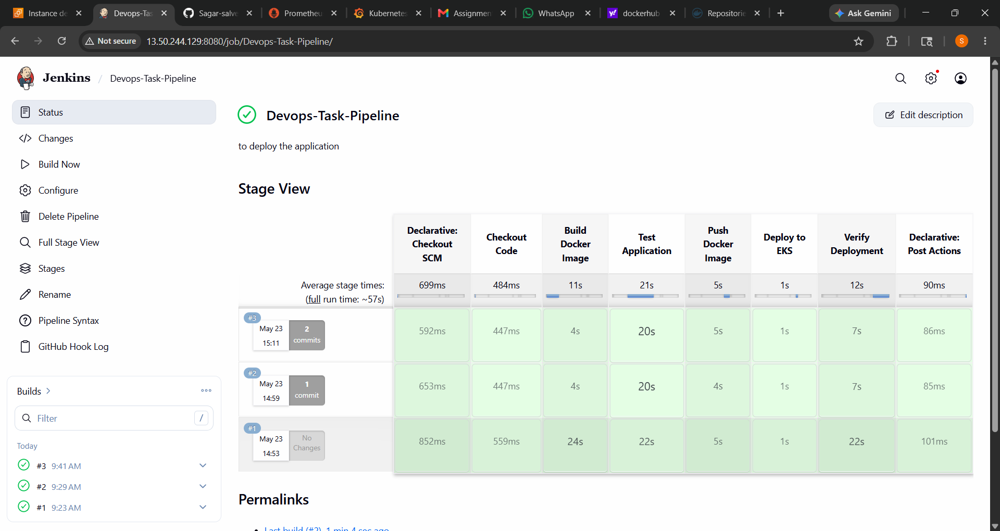
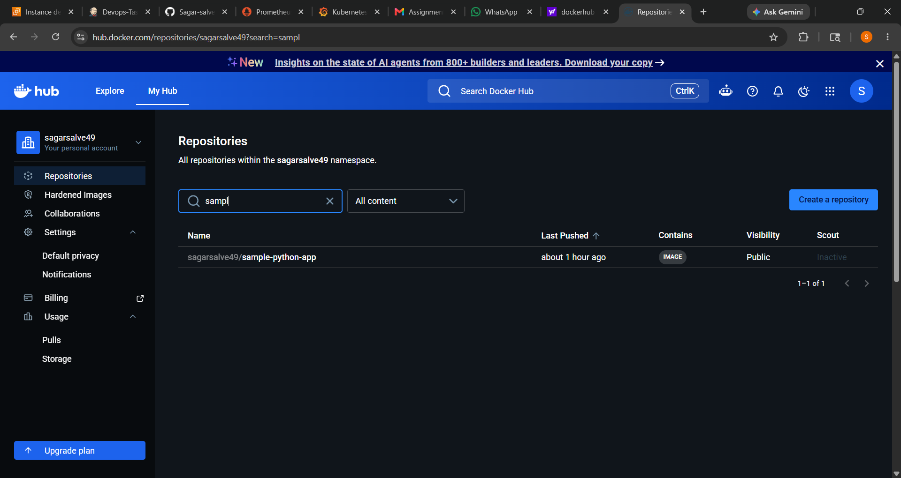
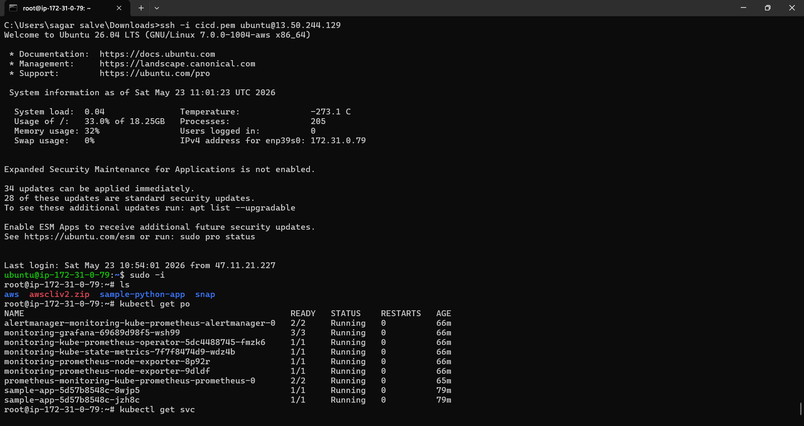
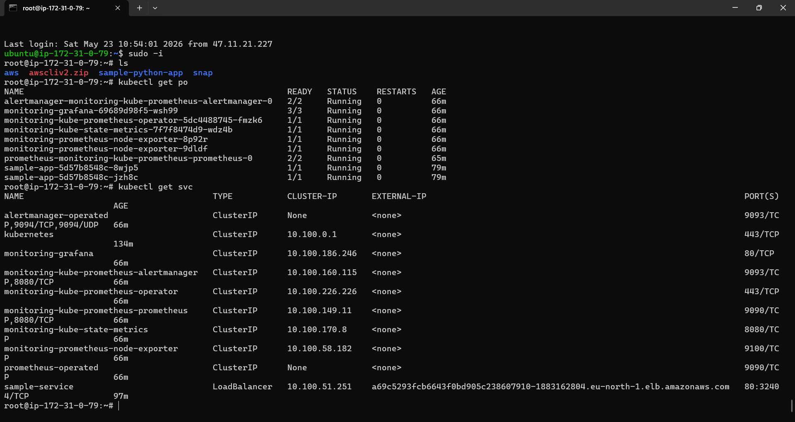
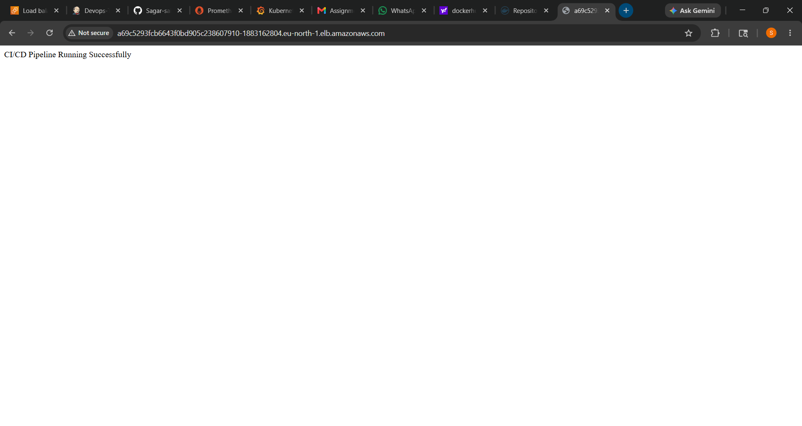
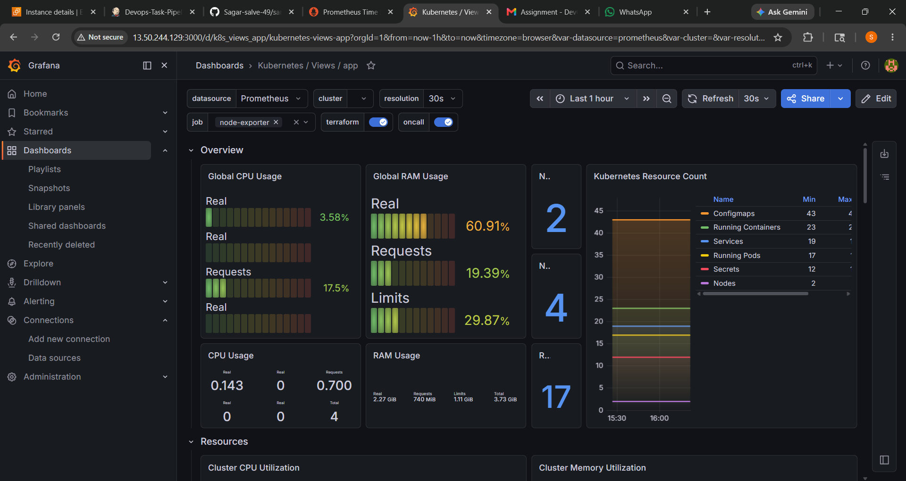
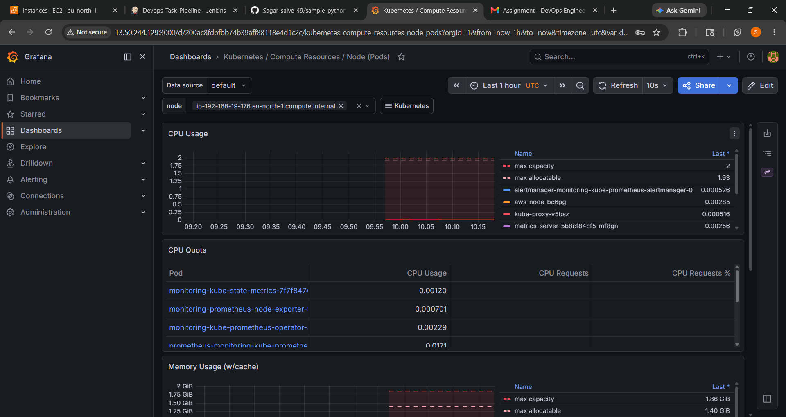
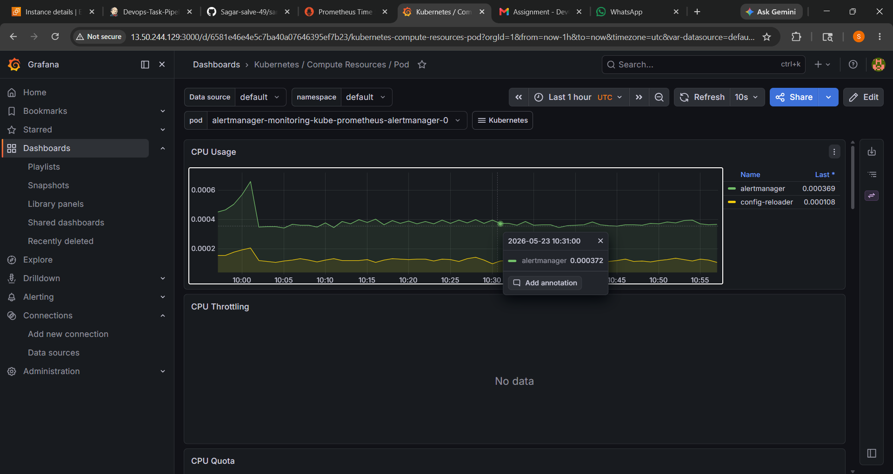

# DevOps CI/CD Pipeline Project

# End-to-End CI/CD Pipeline Using Jenkins, Docker, Kubernetes (EKS), Prometheus & Grafana

---

# Project Overview

This project demonstrates a complete DevOps CI/CD pipeline that automates:

- Source code integration from GitHub
- Docker image build process
- Automated testing
- Docker image push to DockerHub
- Deployment to AWS EKS Kubernetes Cluster
- Monitoring using Prometheus and Grafana

The entire workflow is automated using Jenkins Pipeline.

GitHub Repository:

https://github.com/Sagar-salve-49/sample-python-app.git

---

# Technologies Used

| Tool | Purpose |
|---|---|
| GitHub | Source Code Management |
| Jenkins | CI/CD Automation |
| Docker | Containerization |
| DockerHub | Container Registry |
| AWS EC2 | Jenkins Server |
| AWS EKS | Kubernetes Cluster |
| Kubernetes | Container Orchestration |
| Prometheus | Monitoring |
| Grafana | Visualization Dashboard |
| Python Flask | Sample Application |
| Java 21 | Jenkins Runtime |

---

# Architecture Diagram

```text
Developer Push Code
        ↓
     GitHub
        ↓
 Jenkins Pipeline
        ↓
 Build Docker Image
        ↓
 Push Image to DockerHub
        ↓
 Deploy to AWS EKS
        ↓
 Kubernetes Deployment
        ↓
 Prometheus + Grafana Monitoring
```

---

# AWS Infrastructure Used

| Resource | Count | Type |
|---|---|---|
| Jenkins EC2 | 1 | c7i-flex.large |
| EKS Worker Nodes | 2 | t3.small |
| EKS Cluster | 1 | Managed |

---

# Project Structure

```text
sample-python-app/
│
├── app.py
├── requirements.txt
├── Dockerfile
├── Jenkinsfile
├── .env.example
├── README.md
│
└── k8s/
    ├── deployment.yaml
    └── service.yaml
```

---

# Step 1: Launch Jenkins EC2 Server

## EC2 Configuration

- AMI: Ubuntu 22.04
- Instance Type: c7i-flex.large
- Storage: 20 GB

## Security Group Ports

| Port | Purpose |
|---|---|
| 22 | SSH |
| 8080 | Jenkins |
| 5000 | Flask Application |
| 3000 | Grafana |
| 80 | HTTP |
| 443 | HTTPS |

---

# Step 2: Install Java 21

```bash
sudo apt update -y
sudo apt install openjdk-21-jdk -y
```

Verify Java:

```bash
java -version
```

---

# Step 3: Install Jenkins

```bash
curl -fsSL https://pkg.jenkins.io/debian-stable/jenkins.io-2023.key | sudo tee \
/usr/share/keyrings/jenkins-keyring.asc > /dev/null
```

```bash
echo deb [signed-by=/usr/share/keyrings/jenkins-keyring.asc] \
https://pkg.jenkins.io/debian-stable binary/ | sudo tee \
/etc/apt/sources.list.d/jenkins.list > /dev/null
```

```bash
sudo apt update
sudo apt install jenkins -y
```

Enable and Start Jenkins:

```bash
sudo systemctl enable jenkins
sudo systemctl start jenkins
```

Check Jenkins Status:

```bash
sudo systemctl status jenkins
```

Access Jenkins:

```text
http://<JENKINS_PUBLIC_IP>:8080
```

Get Jenkins Initial Password:

```bash
sudo cat /var/lib/jenkins/secrets/initialAdminPassword
```

---

# Step 4: Install Docker

```bash
sudo apt install docker.io -y
```

Enable Docker:

```bash
sudo systemctl enable docker
sudo systemctl start docker
```

Add Docker Permissions:

```bash
sudo usermod -aG docker ubuntu
sudo usermod -aG docker jenkins
```

Apply Changes:

```bash
newgrp docker
```

Restart Jenkins:

```bash
sudo systemctl restart jenkins
```

Verify Docker:

```bash
docker --version
```

---

# Step 5: Install kubectl

```bash
curl -LO "https://dl.k8s.io/release/$(curl -L -s \
https://dl.k8s.io/release/stable.txt)/bin/linux/amd64/kubectl"
```

```bash
chmod +x kubectl
```

```bash
sudo mv kubectl /usr/local/bin/
```

Verify kubectl:

```bash
kubectl version --client
```

---

# Step 6: Install eksctl

```bash
curl --silent --location \
"https://github.com/weaveworks/eksctl/releases/latest/download/eksctl_$(uname -s)_amd64.tar.gz" \
| tar xz -C /tmp
```

```bash
sudo mv /tmp/eksctl /usr/local/bin
```

Verify eksctl:

```bash
eksctl version
```

---

# Step 7: Install AWS CLI

```bash
curl "https://awscli.amazonaws.com/awscli-exe-linux-x86_64.zip" -o "awscliv2.zip"
```

```bash
sudo apt install unzip -y
```

```bash
unzip awscliv2.zip
```

```bash
sudo ./aws/install
```

Verify AWS CLI:

```bash
aws --version
```

Configure AWS:

```bash
aws configure
```

---

# Step 8: Create EKS Cluster

```bash
eksctl create cluster \
--name devops-cluster \
--region eu-north-1 \
--nodegroup-name workers \
--node-type t3.small \
--nodes 2
```

Verify Cluster:

```bash
kubectl get nodes
```

---

# Step 9: Create Flask Application

## app.py

```python
from flask import Flask

app = Flask(__name__)

@app.route('/')
def home():
    return "CI/CD Pipeline Running Successfully"

@app.route('/health')
def health():
    return "healthy"

if __name__ == '__main__':
    app.run(host='0.0.0.0', port=5000)
```

Run Application:

```bash
python3 app.py
```

Access Application:

```text
http://<SERVER-IP>:5000
```

---

# Step 10: Create requirements.txt

```text
flask
```

---

# Step 11: Create .env.example

```text
APP_PORT=5000
```

---

# Step 12: Create Dockerfile

```dockerfile
FROM python:3.10

WORKDIR /app

COPY requirements.txt .

RUN pip install -r requirements.txt

COPY . .

EXPOSE 5000

CMD ["python", "app.py"]
```

Build Docker Image:

```bash
docker build -t sample-python-app .
```

Run Container:

```bash
docker run -d -p 5000:5000 sample-python-app
```

---

# Step 13: Create Kubernetes Deployment

## k8s/deployment.yaml

```yaml
apiVersion: apps/v1
kind: Deployment

metadata:
  name: sample-app

spec:
  replicas: 2

  selector:
    matchLabels:
      app: sample-app

  template:
    metadata:
      labels:
        app: sample-app

    spec:
      containers:
      - name: sample-app
        image: sagarsalve49/sample-python-app:latest

        ports:
        - containerPort: 5000
```

Apply Deployment:

```bash
kubectl apply -f k8s/deployment.yaml
```

---

# Step 14: Create Kubernetes Service

## k8s/service.yaml

```yaml
apiVersion: v1
kind: Service

metadata:
  name: sample-service

spec:
  type: LoadBalancer

  selector:
    app: sample-app

  ports:
    - port: 80
      targetPort: 5000
```

Apply Service:

```bash
kubectl apply -f k8s/service.yaml
```

Verify Service:

```bash
kubectl get svc
```

---

# Step 15: Jenkins Pipeline Configuration

## Jenkinsfile

```groovy
pipeline {

    agent any

    environment {
        IMAGE_NAME = "sagarsalve49/sample-python-app"
        IMAGE_TAG = "${BUILD_NUMBER}"
    }

    stages {

        stage('Checkout Code') {
            steps {
                git branch: 'main',
                url: 'https://github.com/Sagar-salve-49/sample-python-app.git'
            }
        }

        stage('Build Docker Image') {
            steps {
                sh '''
                docker build -t $IMAGE_NAME:$IMAGE_TAG .
                '''
            }
        }

        stage('Test Application') {
            steps {
                sh '''
                docker run -d --name test-app-container \
                -p 5000:5000 $IMAGE_NAME:$IMAGE_TAG

                sleep 10

                curl -f http://localhost:5000/health

                docker stop test-app-container
                docker rm test-app-container
                '''
            }
        }

        stage('Push Docker Image') {

            steps {

                withCredentials([usernamePassword(
                    credentialsId: 'dockerhub-creds',
                    usernameVariable: 'DOCKER_USER',
                    passwordVariable: 'DOCKER_PASS'
                )]) {

                    sh '''
                    echo $DOCKER_PASS | docker login -u $DOCKER_USER --password-stdin

                    docker push $IMAGE_NAME:$IMAGE_TAG
                    '''
                }
            }
        }

        stage('Deploy to EKS') {

            steps {

                sh '''
                sed -i "s|image: .*|image: $IMAGE_NAME:$IMAGE_TAG|g" \
                k8s/deployment.yaml

                kubectl apply -f k8s/deployment.yaml

                kubectl apply -f k8s/service.yaml
                '''
            }
        }

        stage('Verify Deployment') {

            steps {

                sh '''
                kubectl rollout status deployment/sample-app
                kubectl get pods
                kubectl get svc
                '''
            }
        }
    }

    post {

        success {
            echo 'CI/CD Pipeline Executed Successfully'
        }

        failure {
            echo 'Pipeline Failed'
        }
    }
}
```

---

# Step 16: Install Jenkins Plugins

Go to:

```text
Manage Jenkins
→ Plugins
→ Available Plugins
```

Install the following plugins:

- Git Plugin
- GitHub Integration Plugin
- Docker Pipeline
- Kubernetes
- Pipeline
- Pipeline Stage View
- Credentials Binding

Restart Jenkins after plugin installation.

---

# Step 17: Configure DockerHub Credentials

Jenkins Path:

```text
Manage Jenkins
→ Credentials
→ Global Credentials
→ Add Credentials
```

Credential Type:

```text
Username with Password
```

Credential ID:

```text
dockerhub-creds
```

---

# Step 18: Create Jenkins Pipeline Job

```text
New Item
→ Pipeline
→ Pipeline Script from SCM
→ Git
```

Repository URL:

```text
https://github.com/Sagar-salve-49/sample-python-app.git
```

Branch:

```text
*/main
```

Script Path:

```text
Jenkinsfile
```

Save and Build Pipeline.

---

# Step 19: Configure GitHub Webhook

GitHub Path:

```text
Repository
→ Settings
→ Webhooks
→ Add Webhook
```

Payload URL:

```text
http://<JENKINS_PUBLIC_IP>:8080/github-webhook/
```

Content Type:

```text
application/json
```

Select:

```text
Just the push event
```

Save Webhook.

---

# Step 20: Monitoring Setup

## Install Helm

```bash
curl https://raw.githubusercontent.com/helm/helm/main/scripts/get-helm-3 | bash
```

Verify Helm:

```bash
helm version
```

---

## Add Prometheus Repository

```bash
helm repo add prometheus-community \
https://prometheus-community.github.io/helm-charts
```

```bash
helm repo update
```

---

## Install Monitoring Stack

```bash
helm install monitoring prometheus-community/kube-prometheus-stack
```

Check Monitoring Pods:

```bash
kubectl get pods
```

---

# Step 21: Access Prometheus

Port Forward Prometheus:

```bash
kubectl port-forward svc/monitoring-kube-prometheus-prometheus 9090:9090
```

Access:

```text
http://localhost:9090
```

---

# Step 22: Access Grafana

Get Grafana Password:

```bash
kubectl get secret monitoring-grafana \
-o jsonpath="{.data.admin-password}" | base64 --decode
```

Port Forward Grafana:

```bash
kubectl port-forward svc/monitoring-grafana 3000:80
```

Access Grafana:

```text
http://localhost:3000
```

Default Username:

```text
admin
```

---

# Screenshots

## 1. GitHub Repository


---

## 2. Jenkins Pipeline Stage View



---

## 3. DockerHub Repository



---

## 4. Kubernetes Pods



---

## 5. Kubernetes Services



---

## 6. Running Flask Application



---

## 7. Prometheus Dashboard



---

## 8. Grafana CPU & Memory Monitoring



---

## 9. Grafana Pod Monitoring


---

# Conclusion

Successfully implemented a complete end-to-end CI/CD pipeline using:

- Jenkins
- Docker
- Kubernetes (EKS)
- Prometheus
- Grafana

The project automates:

- Code Integration
- Containerization
- Automated Testing
- Deployment
- Monitoring

This project demonstrates real-world DevOps automation, CI/CD practices, container orchestration, and monitoring implementation on AWS Cloud.
